# Backtracking

Backtracking is an algorithmic technique used for solving problems recursively by trying to build a solution
incrementally, one piece at a time, and removing those solutions that fail to satisfy the conditions of the problem at
any point of time. (trying out all possibilities using recursion)

## Generate Valid Parentheses

Given an int A, write a function to generate all combinations of well-formed parentheses of length 2*A.

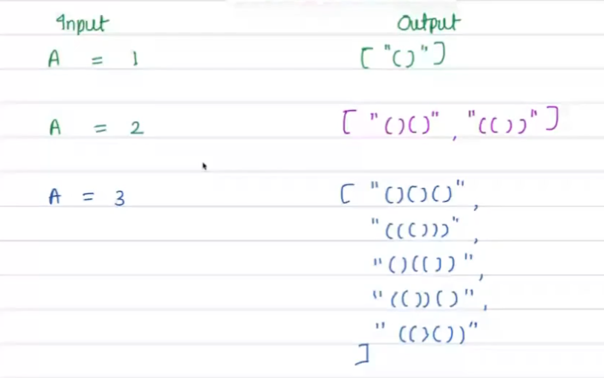

**Concept and Approach**

**Balanced Parentheses**: The parentheses are considered balanced or well-formed when every opening bracket has a
corresponding closing bracket in the correct order.
**Example**:
For ( A = 1 ), the only output is "()"
For ( A = 2 ), the outputs are "()()" and "(())"

The approach involves:
Keeping track of counts of left_count and right_count which stand for left and right parentheses respectively.
You recursively build strings by adding ( or ) while ensuring that:
The number of ( should be less than ( A ).
The number of ) should never exceed the number of ( encountered at any point

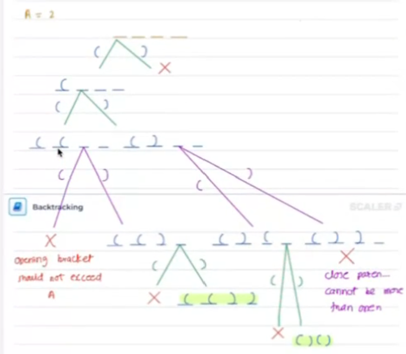

**Pseudocode**

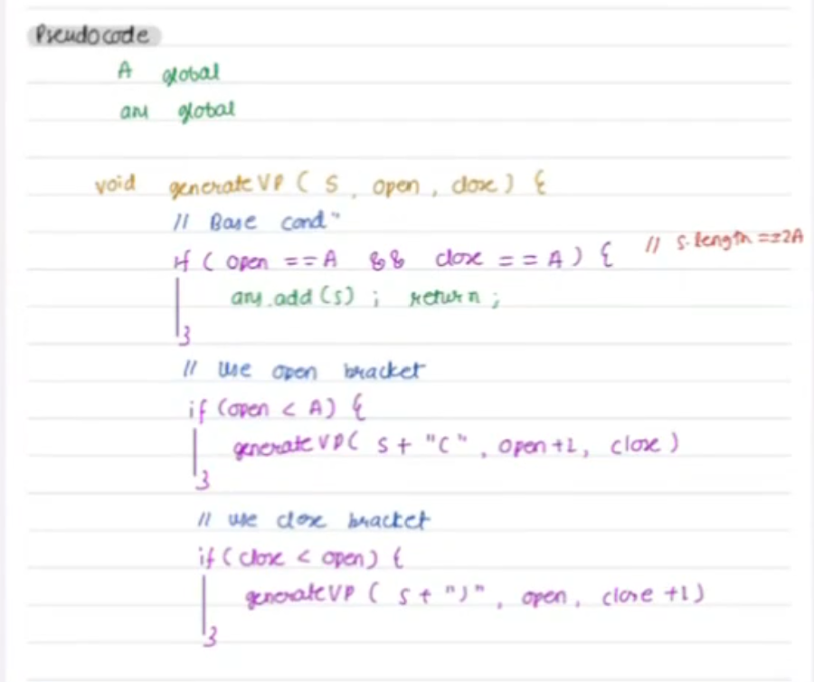

**Dry Run**

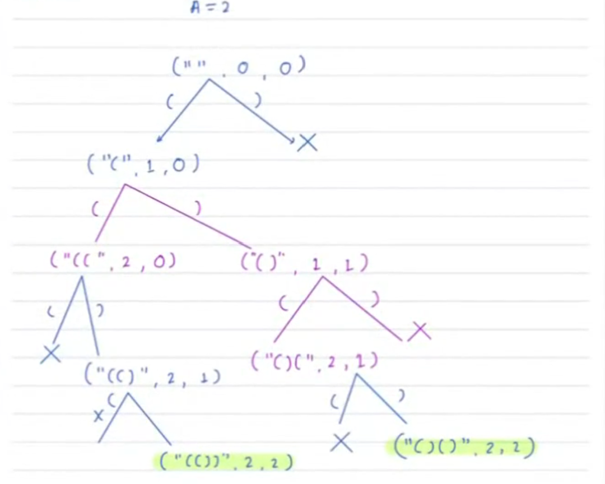

**Solution**

[GenerateValidParentheses](s1/GenerateValidParentheses.java)

**Time and Space Complexity**

**TC** - O (n * 2 ^ n)

**SC** - O (n) - Depth of the tree - which was (2 * n)


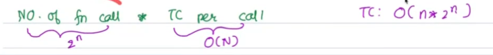

## Definition of subset and subsequence

[2, 8, 12, 5, 3, 16]

**subset**

- any selection of elements of an array in any order.
- empty subset is also a subset.
  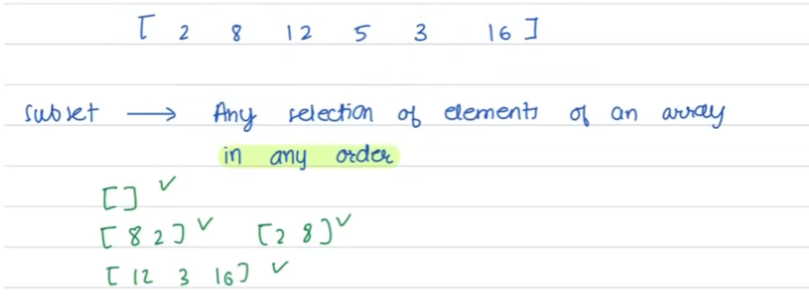

**subsequence**

- it's a subset with order.
- The order is from left to right (same as the order in the array)
  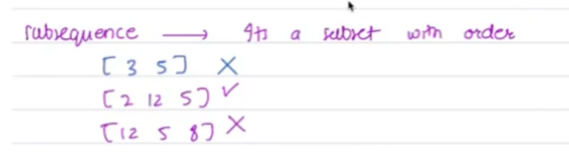

## Generate Subsets

Generate all subsets of given arr[] {distinct}

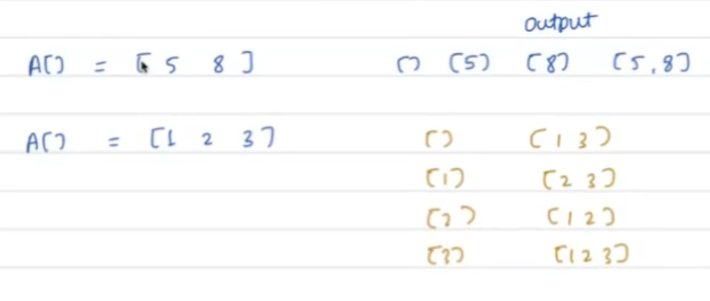

Number of subsets for array of length n will be 2^n.

**Concept and Approach**

Backtracking can be used to generate all subsets of a given set by deciding at each step whether to include an element
in the current subset.

Backtracking Strategy

1. Choices at Each Element:
    - Include it in the current subset.
    - Exclude it and move to the next element.

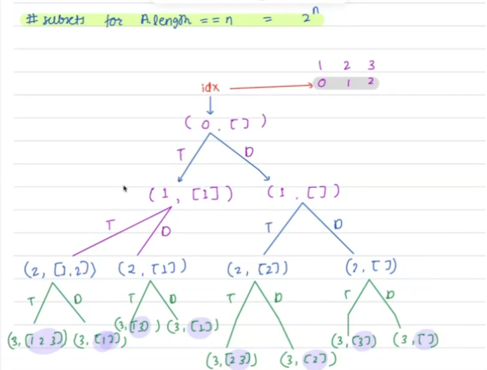

**Pseudocode**

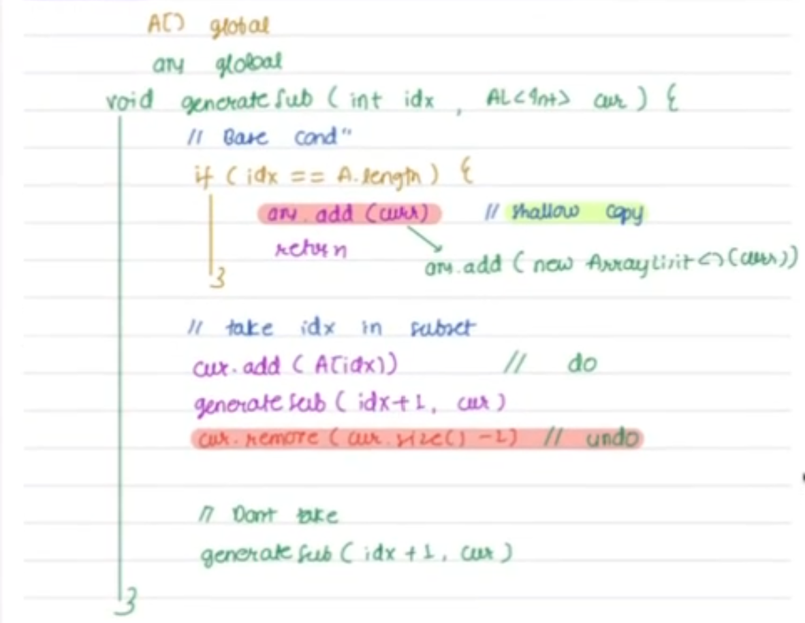

```text
generateSubsets(index, currentSet) {
    if (index == n) {
        output the currentSet;
        return;
    }
    generateSubsets(index + 1, currentSet);
    generateSubsets(index + 1, currentSet + array[index]);
}
```

**Dry Run**

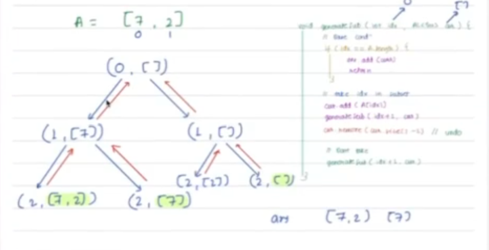

**Solution**

[GenerateSubsets](s1/GenerateSubsets.java)

**Time and Space Complexity**

**TC** - O (n * 2 ^ n) // total 2^n branches and at the last level of each branch we are doing deep copy of
currentAnswer to result (which is O(N) operation)

**SC** - O (n) - Depth of the tree

## Permutations of an input (Fitness meets variety)

Given a string with distinct elements print all permutations of it without modifying input.


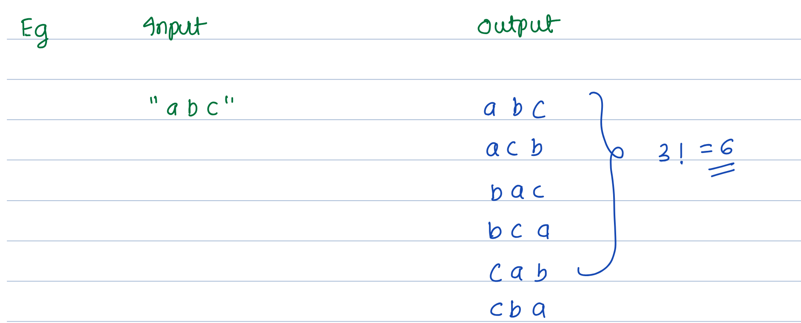

**Concept and Approach**

- Recursively swap characters to generate new permutations while making sure each permutation is unique.
- Use a boolean array to track characters that have already been used in the current permutation.

Use set to maintain the characters used.
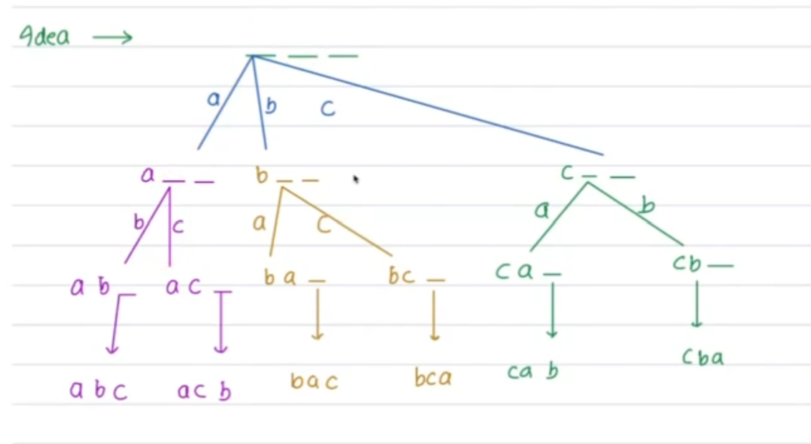

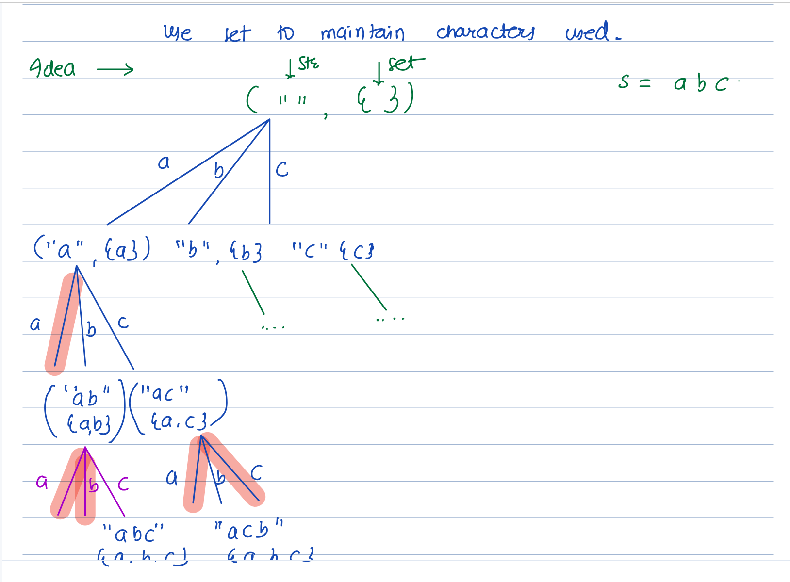

**Pseudocode**

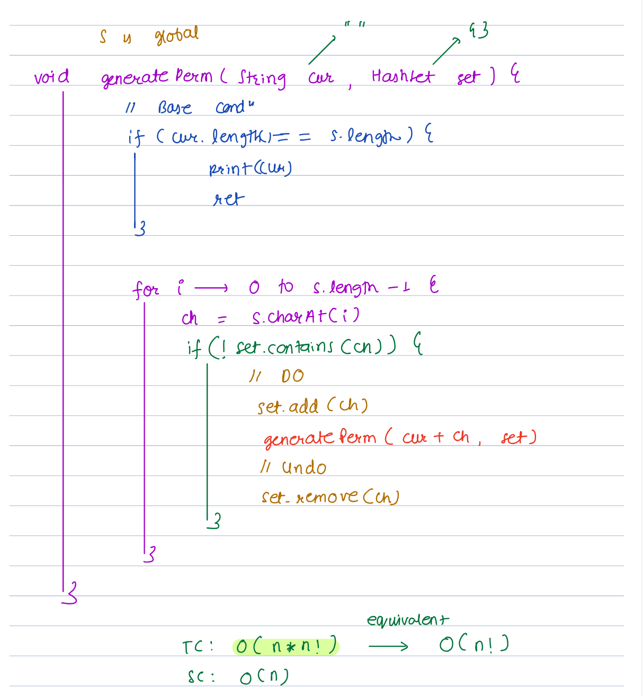

```text
function permutations(array, position, visited) {
    if (position == array.length) {
        print the permutation;
        return;
    }
    for i from 0 to array.length - 1 {
        if visited[i] == false {
            mark visited[i] = true;
            output[position] = array[i];
            permutations(array, position + 1, visited);
            mark visited[i] = false;
        }
    }
}
```

**Solution**

[GeneratePermutations](s1/GeneratePermutations.java)

**Time and Space Complexity**

**TC** - O (n * n!) // total n! branches and at the last level of each branch we are printing the answer (which is O(N)
operation)

**SC** - O (n) - Depth of the tree