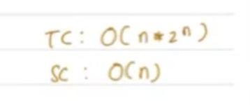

# Backtracking

trying out all possibilities using recursion

## Generate Valid Parentheses

Given an int A, write a function to generate all combinations of well formed parantheses of length 2*A. 

**Approach**

**Pseudocode**

**Dry Run**

**Time and Space Complexity**

**TC** - O (n * 2 ^ n)

**SC** - O (n) - Depth of the tree - which was (2 * n)

